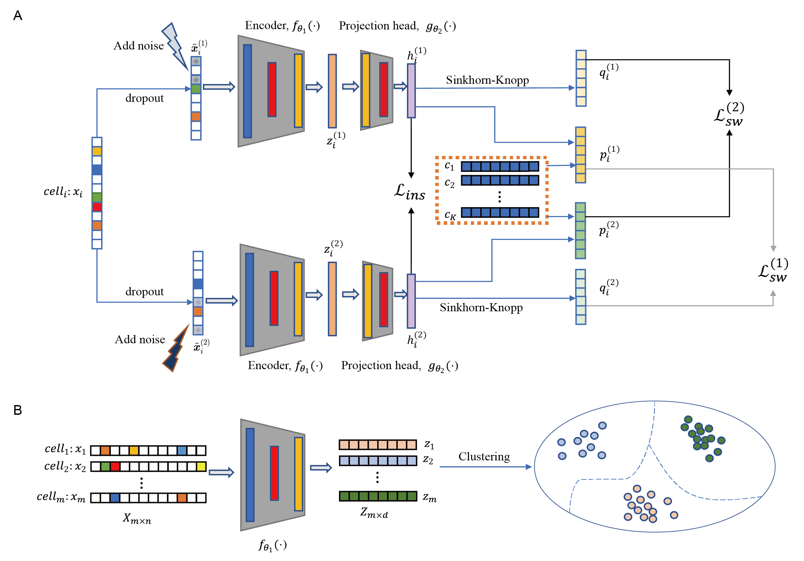

# scSCC

## overview



## Shell tutorial

If you want to run `scSCC` in the terminal, you should first move the preprocessed '.h5' data to the `XYData` fold. We provide an example of the data in `XYData` fold hence you can run scSCC with the following command:

```shell
python run.py -ds "Lung"
```

You can use the `-ds` parameter to specify the dataset. Other parameters are listed in `parse.py`.

Due to the size limitation, only one dataset is uploaded on this repository, and you can get other preprocessed data used in scSCC via this [link](https://drive.google.com/drive/folders/1-ZyTpLthZTXIJeNMXIf16QhjziOIWYD0?usp=drive_link).

## Jupyter tutorial

You can also run scSCC in a jupyter notebook. The package of scSCC is located at `scSCCPKG/scSCC` and a tutorial is provided in `./scSCCPKG/work.ipynb`. Similarly, you should also move your data to `./scSCCPKG/XYData` fold, and then you can run scSCC under the instructions in the tutorial file.

## Quick start

Load data to be analyzed:

```python
import h5py
import numpy as np

import scSCC

sample_name = 'QSTrachea'

with h5py.File(f"./XYData/{sample_name}.h5", 'r') as f:
    X = np.array(f['X'])
    Y = np.array(f['Y']).reshape([
        -1,
    ])
    X = np.ceil(X).astype(np.float32)
    input_data = scSCC.normalizeData(X)
    input_data = input_data.X.astype(np.float32)

n_cluster = len(set(Y))
```

## extract cell representations by scSCC

```python
model = scSCC.scSCC(input_data, n_cluster, sample_name)
embeddings = model.train()
```
